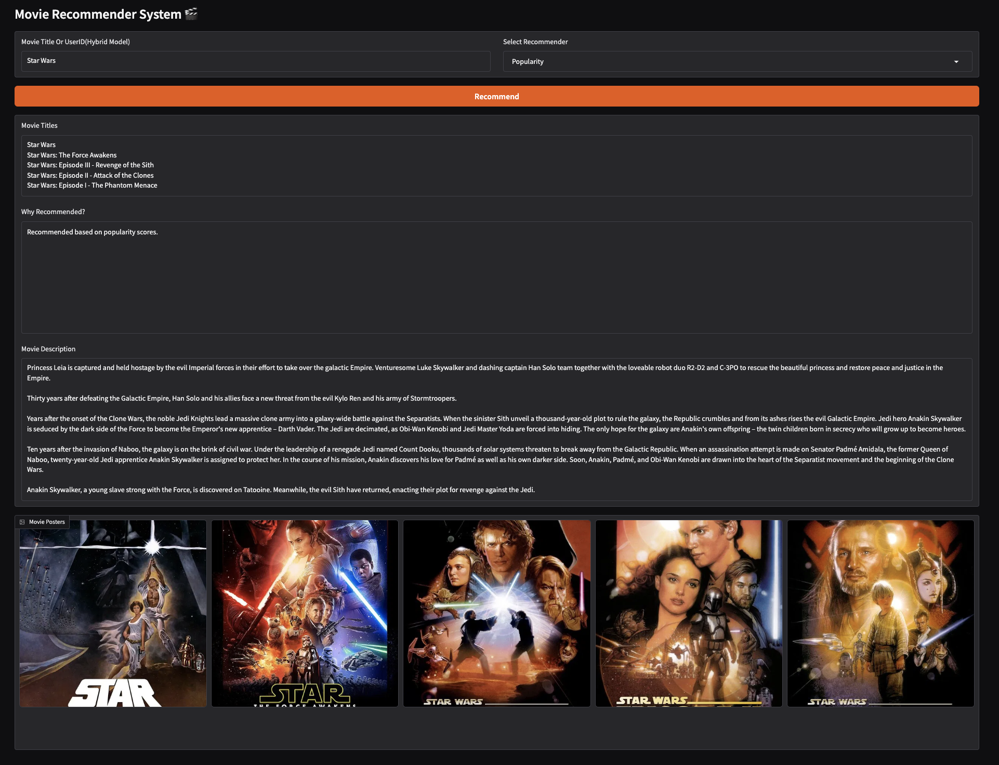

# Movies Recommendation System 🎬

In this project, based on the assigned tasks, I built a mini movie recommender app that suggests movies using the 4th model. 🎞️ 🎥

Turn your VPN on then :
[Let's see my Porject](https://huggingface.co/spaces/Grmobin/Movie_Recommeder_system)

# Data

The dataset is from Kaggle ( [The Movies Dataset](https://www.kaggle.com/datasets/rounakbanik/the-movies-dataset?select=ratings_small.csv) ) and contains 7 files:

``redits.csv``

``keywords.csv``

``links.csv``

``links_small.csv``

``movies_metadata.csv``

``ratings.csv``

``ratings_small.csv``

Well, for easier handling, I merged them into a single file called `movies.csv` and used that in most of the task.

# Models

`Popularity Model`: Based on the Weighted Rating (WR) calculation.

* If no input is provided, it returns the top 5 best movies.

* If you provide a title or partial keyword, it recommends movies matching that title or containing similar words.

 

 

`Content-Based Model`:Uses TF-IDF fitted on the movie overviews. It can suggest movies based on both genre and title.

* In the app’s UI, you can only search by movie title.

* The genre-based version can be explored in `ContentBased.ipynb`.

 

 

`Collaborative Filtering`: Implemented using KNN with Cosine similarity.

* Achieved the highest accuracy of about 37%.

 

 

`Hybrid Model`: A combination of Content-Based (CB) and Collaborative Filtering (CF), with α = 0.5.

 

 

